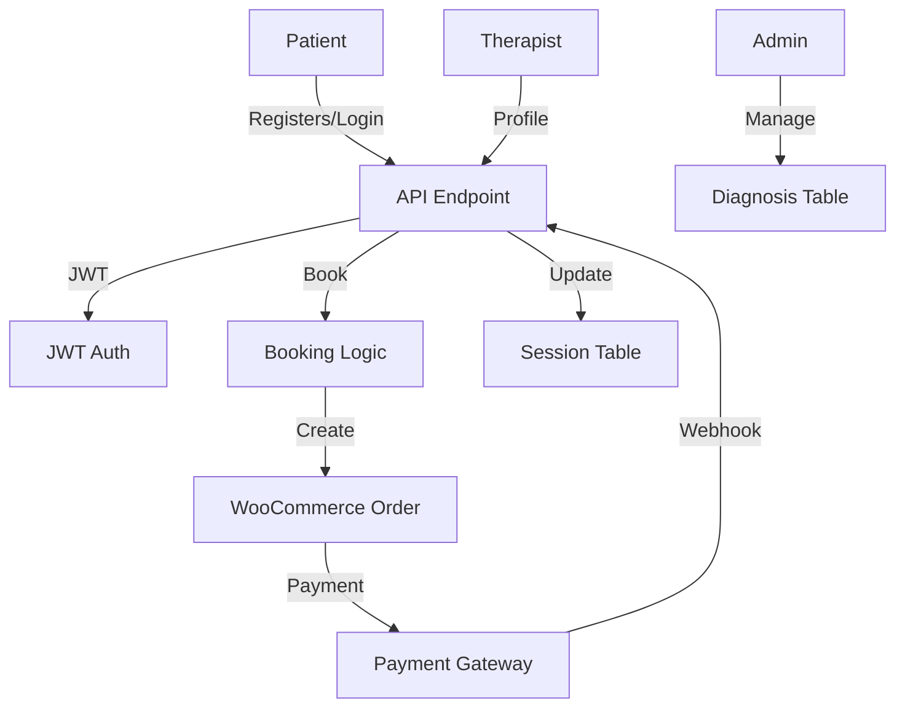

# 🧠 Jalsah AI Integration with DoctorAppointments Plugin

## Overview
This document details the step-by-step plan and technical architecture for integrating the Jalsah AI appointment system with the existing DoctorAppointments WordPress plugin. The goal is to enable the new AI-powered platform (jalsah-ai.app) to leverage the robust booking, session, and payment infrastructure of the current system, while introducing AI-specific features and flows.

---

## 1. System Architecture
- **Main System**: Existing DoctorAppointments plugin (WordPress, WooCommerce)
- **AI Platform**: jalsah-ai.app (separate frontend, connects via API/JWT)
- **Integration**: Secure REST API endpoints, JWT authentication, shared database tables, and meta fields

---

## 2. Database & Data Model Changes
### 2.1. New Tables
- `snks_diagnoses`: Stores diagnosis types for AI matching
- `snks_therapist_diagnoses`: Maps therapists to diagnoses, with ratings and suitability messages

### 2.2. User Meta Extensions
- `show_on_ai_site` (bool): Show therapist on AI platform
- `ai_bio` (text): Short bio for AI
- `ai_certifications` (gallery): Certification images
- `ai_earliest_slot` (datetime): Next available slot

### 2.3. Appointment Table Changes
- Add `from_jalsah_ai` flag to orders and sessions
- Enforce 45-minute, online-only sessions for AI bookings

---

## 3. Authentication & Security
### 3.1. JWT Authentication
- Implement JWT token generation and validation for API endpoints
- Endpoints:
  - `POST /api/ai/auth/login`
  - `POST /api/ai/auth/register`
  - `POST /api/ai/auth/verify-email`
- Store tokens securely, support refresh tokens

### 3.2. User Registration & Login
- Accept all required fields (first name, last name, age, email, phone, WhatsApp, country, password)
- Email verification with resend logic
- Update missing fields for existing users
- Token-based login only

---

## 4. API Endpoints
### 4.1. Therapist & Diagnosis
- `GET /api/ai/therapists` — List therapists (with filters)
- `GET /api/ai/therapists/{id}` — Therapist details
- `GET /api/ai/therapists/by-diagnosis/{diagnosis_id}` — Filter by diagnosis
- `GET /api/ai/diagnoses` — List all diagnoses

### 4.2. Appointments
- `GET /api/ai/appointments/available` — List available 45-min online slots
- `POST /api/ai/appointments/book` — Book a session (with real-time availability check)
- `GET /api/ai/appointments/user/{user_id}` — List user’s bookings

### 4.3. Cart & Payment
- `POST /api/ai/cart/add` — Add slot to AI cart
- `GET /api/ai/cart/{user_id}` — Get current cart
- `POST /api/ai/cart/checkout` — Confirm and create WooCommerce order
- Webhook for payment success to clear cart

---

## 5. Booking & Session Logic
### 5.1. AI Booking Flow
- Only 45-minute, online sessions are bookable
- Add-to-cart system (one therapist per cart, multiple slots allowed)
- Real-time slot availability check before booking
- Cart is separate from WooCommerce cart (custom session or DB table)
- On checkout, create WooCommerce order with all bookings, status `pending`, and `from_jalsah_ai = true`
- No patient association until payment is complete
- 15-minute payment timer; auto-cancel and free slots if expired

### 5.2. Session Management
- Use existing timetable/session tables
- Mark sessions as "past" when therapist marks attendance or ends session
- Use `snks_sessions_actions` for attendance
- Tag AI appointments with a green "AI" badge

---

## 6. Therapist & Diagnosis Management
### 6.1. Admin Panel Extensions
- Manage diagnosis list (CRUD)
- Assign diagnoses to therapists
- Set ratings and suitability messages per diagnosis/therapist
- Toggle therapist visibility on AI site
- Edit AI-specific bio, certifications, earliest slot

---

## 7. Frontend & User Experience
### 7.1. Patient Flows
- Registration/login (token-based, enforced before app access)
- Homepage: Smart matching (ChatGPT diagnosis) or browse therapists
- Appointments page: View past/upcoming AI bookings
- Cart: Review, apply coupon, confirm booking, see payment summary
- Payment: Email and on-page link, 15-min timer, retry if expired

### 7.2. Therapist Flows
- Display only if `show_on_ai_site` is true
- Show AI-specific info (bio, certifications, earliest slot, price)
- Ratings and suitability per diagnosis

---

## 8. Payment & Order Handling
- Use WooCommerce for payment processing
- Store all AI bookings in a single order (status: `pending` until paid)
- On payment success, trigger webhook to clear AI cart and associate sessions with patient
- Auto-cancel unpaid orders after 15 minutes

---

## 9. Notifications & Webhooks
- Email and SMS notifications for booking, payment, reminders
- Webhook endpoint for payment success (to clear cart, update sessions)

---

## 10. Security & Compliance
- All API endpoints require JWT authentication
- Input validation and sanitization on all endpoints
- Rate limiting and logging for sensitive actions

---

## 11. Testing & QA
- Unit and integration tests for all API endpoints
- End-to-end tests for booking and payment flows
- Manual QA for admin and therapist management

---

## 12. Deployment & Maintenance
- Database migrations for new tables/fields
- Backward compatibility with existing system
- Documentation for API consumers (jalsah-ai.app frontend)
- Ongoing monitoring and support

---

## 13. Future Considerations
- Coupon system: Decide between WooCommerce or custom
- Analytics dashboard for AI platform
- Expand to support other session types if needed

---

## 14. Appendix: Data Flow Diagram

---

# End of Integration Plan 